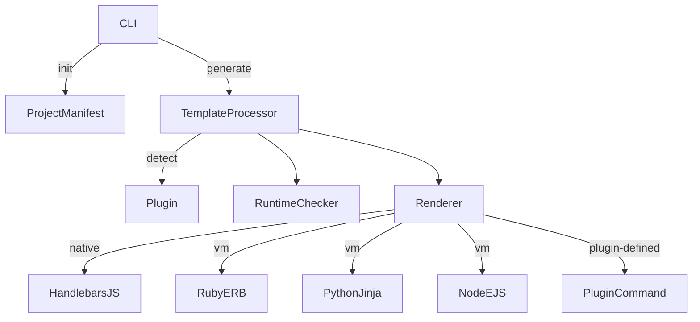

# Forge: AI and Human-Driven Template CLI

## Overview

**Forge** is a pluggable, extensible CLI tool designed to scaffold, manage, and modernize codebases using both AI and template-driven approaches. It integrates:

* AI-generated content (LLM optional)
* Human-crafted templates
* Pluggable workflows and lifecycle actions
* Multiple templating engines
* Online and air-gapped support

## WARNING  This project is under active development and heavy design
This is currently an idea with no working implementation yet.  I am currently working on making it a reality and I am excited to share it with you soon!  For the time being you can follow along with the project on GitHub.

## Key Goals

* Scaffold projects using **AI and human-driven templates**
* Support full lifecycle actions: `generate`, `update`, `validate`, `test`, `deploy`, `notify`, `publish`
* Plugin-based workflows
* Multi-engine template rendering (ERB, Jinja, Handlebars, EJS)
* Run locally or optionally with remote render agents
* Preview diffs, avoid destructive changes
* Support offline and air-gapped workflows

## Architecture Diagram



## Components

### 🔌 Plugin

* Declarative manifest file (`plugin.json`)
* Specifies:

  * Detection rules (files/patterns)
  * Templates repo URL
  * Template rendering engines
  * Lifecycle command mappings
  * Custom renderers
  * Built-in agent instructions and prompts

### 🧠 LLM Integration (Optional)

* LLMs generate or assist in filling in template content
* Agent instructions and prompts are versioned in plugin/template metadata
* Supports remote execution (serverless) and local fallback

### 🧩 Template System

* Template formats: `.erb`, `.jinja`, `.hbs`, `.ejs`, `.tmpl`
* Template engine inferred from extension or explicitly declared
* Templates support composition/inheritance (à la GitHub Actions)
* Each plugin links to or embeds templates
* User can override or fork templates
* Template manifests include lifecycle actions and agent prompt files

### ⚙️ Lifecycle Actions

* Defined per plugin or per template
* Stages:

  * `generate`
  * `update`
  * `validate`
  * `test`
  * `deploy`
  * `notify`
  * `publish`
  * `build`
* Executed via command sequences or remote agent calls

### 🔐 Runtime Detection

* Required runtimes are inferred from:

  * File extensions (`.erb` → Ruby, `.ejs` → Node.js)
  * Plugin-declared custom renderers
* Only relevant runtimes are validated

### 📦 Plugin Index

* Local registry of available plugins
* `plugin-index.json` includes:

  * Name, version, description
  * Install path, files (if installed)
  * Remote template repo
  * Runtime requirements


## CLI Example

```sh
forge init --plugin puppet
forge generate --out ./my-mod
forge plugin install terraform
forge plugin list
forge plugin remove puppet
```

## Security Considerations

* Scripts run in local environment or remoete environment
* Recommend using trusted templates/plugins only
* Prompts for destructive actions
* Environment secrets for LLM managed via config/env or password manager lookup
* Plugin commands must be explicitly declared in manifest

## Offline/Air-Gapped Support

* Full offline support:

  * No LLM needed or use local / on-premises
  * Templates can be bundled
  * Plugins can be installed locally via npm
* Export/import templates or plugins with dependencies

## Extensibility

* Plugins written in TypeScript
* CLI core in Rust for speed and portability
* WASM support for possible plugin isolation
* New plugins can be scaffolded via templates
* Future support for Docker-based render agents

## Roadmap Ideas

* Add `forge check` command to verify runtime/install
* Add dry-run + diff preview support
* Generate documentation from plugin/manifest
* Remote plugin index sync

---

Would you like this proposal turned into a formatted PDF, shared doc, or embedded into a README?
